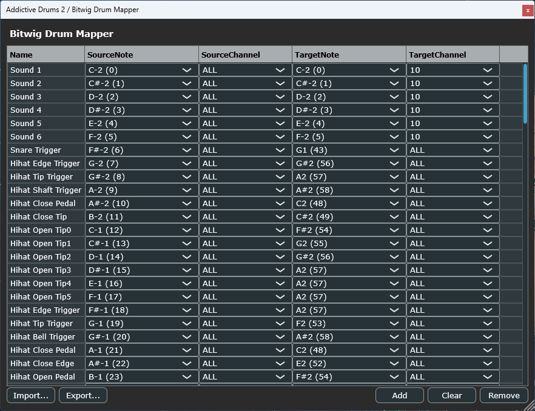

# PowerDrumMapper

A CLAP / VST3 MIDI effect plugin for remapping drum MIDI note numbers and channels. Built with [JUCE 8](https://github.com/juce-framework/JUCE) and [clap-juce-extensions](https://github.com/free-audio/clap-juce-extensions).



## Overview

**PowerDrumMapper** lets you unify different drum sound sources under a single key layout or MIDI trigger scheme. For example, if one drum plugin uses C0 for Kick and another uses C1, you can create a mapping so that both respond to the same input note.

> Formerly named **Bitwig Drum Mapper**. The internal plugin IDs (CLAP ID, VST3 class IDs) are unchanged, so existing host sessions keep resolving the same plugin — only the display name and file names changed. Remember to delete the old `Bitwig Drum Mapper.vst3` / `.clap` from your plugin folders to avoid duplicates.

Each mapping rule defines:

| Field | Description |
|-------|-------------|
| **Name** | A human-readable label (e.g. "Kick") |
| **Source Note** | The incoming MIDI note to match |
| **Source Channel** | The channel to match (`ALL` = any) |
| **Target Note** | The remapped note number to output |
| **Target Channel** | The output channel (`ALL` = preserve original) |

### Default Mapping

| Name | Source | Channel | Target | Channel |
|------|--------|---------|--------|---------|
| Kick | C0 | ALL | C1 | 10 |
| Snare | D0 | ALL | D1 | 10 |
| ESnare | D#0 | ALL | D#1 | 10 |

## Features

- **Real-time MIDI remapping** — Note On/Off events are remapped with zero-latency try-lock processing
- **Editable table UI** — Add, remove, and edit mapping entries; note columns are type-to-filter text cells: typing pops a live-filtered suggestion list, invalid input can never take effect
- **Resizable window** — Drag to resize; table columns adapt automatically
- **Note names in the host** — Mapping names are reported per format: CLAP `note-name` extension (Bitwig), VST3 `IUnitInfo` pitch names (Cubase, FL Studio, ...) and VST2 `effGetMidiKeyName`, all via `AudioProcessor::getNameForMidiNoteNumber()`
- **Import / Export** — Save and load drum maps in `.bwdrm` (CSV) or Cubase `.drm` (XML) format
- **Cross-platform** — Windows and macOS (Universal Binary)

## Plugin Formats

| Format | Target | Output Location |
|--------|--------|----------------|
| CLAP | `PowerDrumMapper_CLAP` | `build/PowerDrumMapper_artefacts/Release/CLAP/` |
| VST3 | `PowerDrumMapper_VST3` | `build/PowerDrumMapper_artefacts/Release/VST3/` |
| Standalone | `PowerDrumMapper_Standalone` | `build/PowerDrumMapper_artefacts/Release/Standalone/` |

## Building from Source

### Prerequisites

- **CMake** >= 3.21
- **C++20** compiler
  - Windows: Visual Studio 2022 (MSVC v143)
  - macOS: Xcode 15+ (Universal Binary: arm64 + x86_64)
- Git (for submodule cloning)

### Build Steps

```bash
# Clone with submodules
git clone --recurse-submodules https://github.com/your-repo/PowerDrumMapper.git
cd PowerDrumMapper

# Configure
cmake -B build -S .

# Build all targets (Release)
cmake --build build --config Release --parallel
```

To build specific formats only:

```bash
cmake --build build --config Release --target PowerDrumMapper_CLAP
cmake --build build --config Release --target PowerDrumMapper_VST3
cmake --build build --config Release --target PowerDrumMapper_Standalone
```

### Tests

```bash
cmake --build build --config Release --target PowerDrumMapperTests
./build/PowerDrumMapperTests_artefacts/Release/PowerDrumMapperTests.exe
```

### macOS Universal Binary

```bash
cmake -B build -S . -DCMAKE_OSX_ARCHITECTURES="arm64;x86_64" -DCMAKE_BUILD_TYPE=Release
cmake --build build --config Release --parallel
```

## Installation

### Windows
Copy the `.clap` or `.vst3` file to:
```
C:\Program Files\Common Files\CLAP\
C:\Program Files\Common Files\VST3\
```

### macOS
Copy the `.clap` or `.vst3` bundle to:
```
~/Library/Audio/Plug-Ins/CLAP/
~/Library/Audio/Plug-Ins/VST3/
```

## Import / Export

### `.bwdrm` Format (Native CSV)

Plain text, one entry per line:

```
Kick,24,0,36,10
Snare,26,0,38,10
ESnare,27,0,39,10
```

Fields: `name,sourceNote,sourceChannel,targetNote,targetChannel`

- Channel `0` = ALL
- Notes are MIDI note numbers (0–127)

### Cubase `.drm` Format (XML)

Cubase drum map exports are automatically detected on import. The following fields are mapped:

| Cubase DRM | PowerDrumMapper |
|------------|-------------------|
| `INote` | Source Note |
| `ONote` | Target Note |
| `Channel` (`-1` = unchanged, `0–15`) | Target Channel (`0` = ALL, `1–16`) |
| `Name` | Name |

## CLAP Note-Name Extension

The plugin reports per-note names through every supported channel: the [`clap.note-name`](https://github.com/free-audio/clap-juce-extensions/blob/main/clap-libs/clap/include/clap/ext/note-name.h) extension in CLAP hosts (e.g. Bitwig), VST3 `IUnitInfo` pitch names (`hasProgramPitchNames` / `getProgramPitchName`, queried by Cubase, FL Studio, ...) and VST2 `effGetMidiKeyName` — all backed by `AudioProcessor::getNameForMidiNoteNumber()`. Each entry's **Name** and **Source Note** are reported, allowing the host to display custom names on the piano roll and note lanes.

The host is automatically notified whenever mappings change (CLAP hosts; VST3 hosts that cache pitch names may need the editor reopened or the plugin reloaded to refresh).

## Project Structure

```
PowerDrumMapper/
├── CMakeLists.txt
├── .github/workflows/build.yml       # CI: Windows + macOS
├── libs/
│   ├── JUCE/                         # JUCE 8.0.14 (submodule)
│   └── clap-juce-extensions/         # CLAP wrapper (submodule)
├── Tests/
│   └── ProcessorTests.cpp            # Headless test runner
└── Source/
    ├── PluginProcessor.h/.cpp        # AudioProcessor + CLAP note-name
    ├── PluginEditor.h/.cpp           # Editor (resizable, DPI handling)
    ├── NoteMapping.h/.cpp            # Core data model + CSV/XML I/O
    ├── NoteNameUtils.h/.cpp          # Note name <-> MIDI number conversion
    └── MappingTableComponent.h/.cpp  # Table UI (combo boxes, buttons)
```

## Tech Stack

- **JUCE 8.0.14** — Audio application framework
- **CLAP SDK 1.2.7** — via clap-juce-extensions
- **CMake 3.21+** — Build system
- **C++20** — Language standard

## CI/CD

GitHub Actions automatically builds Windows and macOS (Universal Binary) artifacts on every push and tag. See [`.github/workflows/build.yml`](.github/workflows/build.yml).

## Note Naming Convention

This plugin uses the **DAW/Bitwig convention** where middle C = C3 (MIDI note 60):

| MIDI Note | Name |
|-----------|------|
| 0 | C-2 |
| 12 | C-1 |
| 24 | C0 |
| 60 | C3 (middle C) |
| 127 | G9 |

## License

This project is open source. JUCE and CLAP SDK are subject to their respective licenses.
